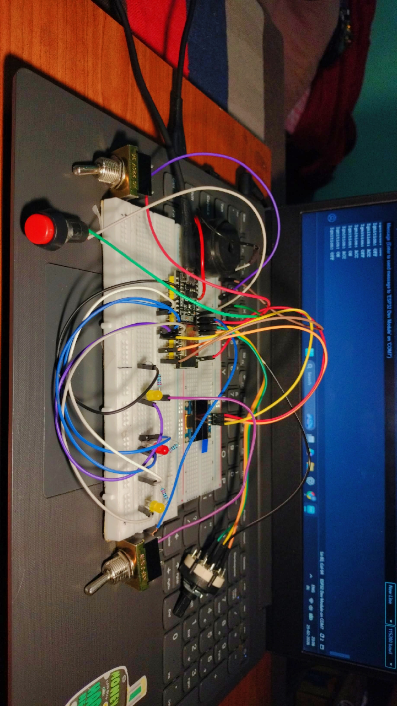
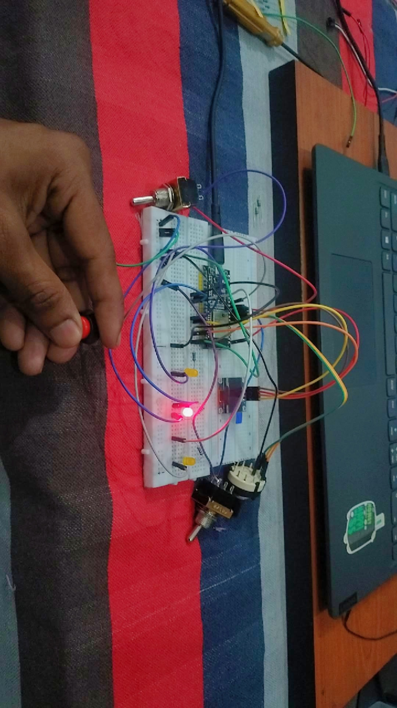

# 🚗 Automotive Body Control Module (BCM) — ESP32

[](https://www.espressif.com/en/products/socs/esp32)
[](https://www.arduino.cc/)
[](LICENSE)
[]()

A compact, real-time **Body Control Module (BCM)** firmware for the ESP32, modeled on automotive ECU design principles. It simulates ignition state management, brake lighting, turn indicators, hazard mode, audible feedback, and an OLED instrument cluster — all driven by a non-blocking event loop.

---

## 📌 Overview

In modern vehicles, the **Body Control Module** is the ECU responsible for low-speed body electronics: lighting, indicators, wipers, locks, and dashboard signaling. This project recreates the core of that responsibility on an ESP32 dev board, using clean state-machine logic and `millis()`-based timing — the same patterns used in production automotive firmware.

The system reads ignition position, brake input, and indicator switches, then drives LEDs, a buzzer, and an SSD1306 OLED dashboard to reflect vehicle state in real time.

---

## ⚙️ Features

- 🔑 **3-State Ignition Machine** — `OFF` / `ACC` / `ON`
- 🛑 **Brake Light Control** — gated by ignition state
- ↔️ **Left & Right Turn Indicators** — independent control
- 🚨 **Hazard Mode** — synchronized dual-indicator blink
- 🔔 **Audible Indicator Buzzer** — synchronized with blink cadence
- 🖥 **SSD1306 OLED Dashboard** — live ignition / brake / indicator status
- ⏱ **Non-blocking Timing** — pure `millis()`-based scheduling, zero `delay()`
- 📟 **Edge-Triggered Serial Logging** — only logs on state change
- 🧠 **Modular Embedded Architecture** — clean GPIO abstraction & state machine

---

## 🧠 System Architecture

```
                ┌────────────────────────────┐
   Rotary SW ──►│                            │──► Left LED
   Left  SW  ──►│                            │──► Right LED
   Right SW  ──►│         ESP32 BCM          │──► Brake LED
   Brake SW  ──►│      (State Machine +      │──► Buzzer
                │       Event Scheduler)     │──► OLED (I²C)
                └────────────────────────────┘
```

### Inputs
| Input | Type | Purpose |
|---|---|---|
| Rotary Switch (3-pos) | INPUT_PULLUP | Ignition: OFF / ACC / ON |
| Toggle Switch (Left) | INPUT_PULLUP | Left turn signal |
| Toggle Switch (Right) | INPUT_PULLUP | Right turn signal |
| Push Button (Brake) | INPUT_PULLUP | Brake pedal |

### Outputs
| Output | Function |
|---|---|
| Left Indicator LED | Blinks @ 500 ms when active |
| Right Indicator LED | Blinks @ 500 ms when active |
| Brake LED | Steady ON while pedal pressed |
| Passive Buzzer | Audible blink feedback |
| SSD1306 OLED (I²C) | Real-time dashboard |

---

## 🔄 Operating Logic

| Ignition | Brake | Indicators | Dashboard |
|---|---|---|---|
| **OFF** | Disabled | Disabled | Shows OFF |
| **ACC** | Disabled | Disabled | Shows ACC |
| **ON** | Active | Active | Full status |

- **Brake press** → Brake LED ON (only when ignition = ON)
- **Left toggle** → Left indicator blinks + buzzer
- **Right toggle** → Right indicator blinks + buzzer
- **Both toggles** → Hazard mode (both indicators sync)

---

## 🛠 Hardware Components

| # | Component | Qty |
|---|---|---|
| 1 | ESP32 Dev Board (WROOM-32) | 1 |
| 2 | SSD1306 0.96" I²C OLED (128×64) | 1 |
| 3 | 3-Position Rotary Switch | 1 |
| 4 | SPST Toggle Switch | 2 |
| 5 | Tactile Push Button | 1 |
| 6 | 5 mm LED (any color) | 3 |
| 7 | 220 Ω Resistor | 3 |
| 8 | Passive Buzzer | 1 |
| 9 | Breadboard + Jumper Wires | — |

---

## 🔌 Pin Mapping

| Function | ESP32 GPIO |
|---|---|
| Ignition OFF | 32 |
| Ignition ACC | 33 |
| Ignition ON | 25 |
| Brake Switch | 14 |
| Brake LED | 17 |
| Left Switch | 26 |
| Right Switch | 27 |
| Left LED | 4 |
| Right LED | 16 |
| Buzzer | 13 |
| OLED SDA | 21 |
| OLED SCL | 22 |

---

## 📷 Prototype Images

### 🔧 Complete Hardware Setup


### 🚨 Indicator Active


---

## 📁 Repository Structure

```
Automotive-Body-Control-Module-ESP32/
├── code/
│   └── bcm_esp32.ino          # Main firmware
├── docs/
│   └── (project documentation)
├── images/
│   ├── hardware_setup.jpg
│   └── indicator_on.jpg
├── LICENSE                    # MIT License
├── .gitignore
└── README.md
```

---

## 🚀 Getting Started

### Prerequisites
- [Arduino IDE](https://www.arduino.cc/en/software) **2.x** (or PlatformIO)
- ESP32 board package: install via Boards Manager → "esp32 by Espressif Systems"
- Required libraries (Library Manager):
  - `Adafruit GFX Library`
  - `Adafruit SSD1306`

### Build & Flash
1. Clone this repository:
   ```bash
   git clone https://github.com/<your-username>/Automotive-Body-Control-Module-ESP32.git
   ```
2. Open `code/bcm_esp32.ino` in Arduino IDE.
3. Select **Tools → Board → ESP32 Dev Module**.
4. Select the correct **Port**.
5. Click **Upload**.
6. Open Serial Monitor @ **115200 baud** to view live logs.

---

## 🧪 Future Enhancements

- 🔗 **CAN Bus Integration** via MCP2515 — multi-ECU communication
- 💡 **Automatic Headlight Control** using LDR / ambient sensor
- 🛠 **Fault Detection & Diagnostics (DTC)** module
- 🏎 **Speed-Based Indicator Auto-Cancel** logic
- 🔧 **Custom PCB Design** for automotive-grade prototype
- 🌐 **OTA Firmware Updates** over Wi-Fi
- 🧩 **Modular Multi-ECU Architecture** (BCM + Engine + Cluster)

---

## 🎯 Learning Outcomes

- Embedded **state-machine** design for safety-critical I/O
- Real-time, **non-blocking** firmware development with `millis()`
- Automotive-grade **event-driven architecture**
- Hardware/software **integration & debugging**
- Clean **GPIO abstraction** and modular firmware structure

---

## 📜 License

Released under the **MIT License**. See [`LICENSE`](LICENSE) for details.

---

## 👨‍💻 Author

**Mohammed Shabaz S**
Electronics & Communication Engineering
Automotive Embedded Systems Enthusiast 🚗🔥

[](https://github.com/)
[](https://www.linkedin.com/)

---

> ⭐ If you found this project useful, please consider giving it a star — it helps others discover it!
